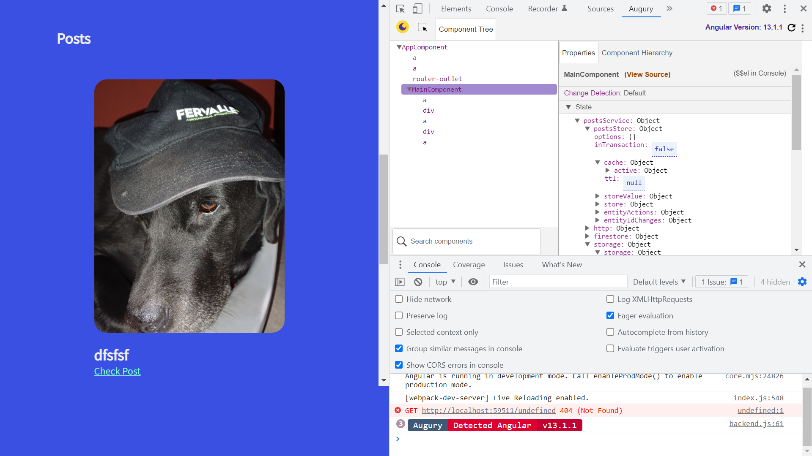

# :zap: Angular Akita Firebase

* Angular app using [Akita state management](https://datorama.github.io/akita/) and Create, Read, Update & Delete (CRUD) functions to interface with a Firebase database. Tutorial code from Aldo Caamal with some updates - see [:clap: Inspiration](#clap-inspiration) below
* **Note:** to open web links in a new window use: _ctrl+click on link_


*** Note: to open web links in a new window use: _ctrl+click on link_**

## :page_facing_up: Table of contents

* [:zap: Angular Akita Firebase](#zap-angular-akita-firebase)
  * [:page_facing_up: Table of contents](#page_facing_up-table-of-contents)
  * [:books: General info](#books-general-info)
  * [:camera: Screenshots](#camera-screenshots)
  * [:signal_strength: Technologies](#signal_strength-technologies)
  * [:floppy_disk: Setup](#floppy_disk-setup)
  * [:wrench: Testing](#wrench-testing)
  * [:computer: Code Examples](#computer-code-examples)
  * [:cool: Features](#cool-features)
  * [:clipboard: Status & To-Do List](#clipboard-status--to-do-list)
  * [:clap: Inspiration](#clap-inspiration)
  * [:file_folder: License](#file_folder-license)
  * [:envelope: Contact](#envelope-contact)

## :books: General info

* Akita used to create the posts.store.ts - an [Akita Entity Store](https://datorama.github.io/akita/docs/entities/entity-store) of single objects that is the single source of truth
* Akita is not being maintained and they themselves recommend using an equivalent reactive store 'https://ngneat.github.io/elf/'

## :camera: Screenshots



## :signal_strength: Technologies

* [Angular framework v15](https://angular.io/)
* [Google Firebase v9](https://firebase.google.com)
* [@ngneat operator until-destroy v9](https://github.com/ngneat/until-destroy/#use-with-ivy) replaces [ngx-take-until-destroy](https://www.npmjs.com/package/ngx-take-until-destroy) to unsubscribe from observables when component destroyed, instead of using Angular ngDestroy lifecycle
* [Akita State Management for JS v7](https://datorama.github.io/akita/)
* [Akita Ng Entity Service v7](https://datorama.github.io/akita/docs/angular/entity-service/)
* [akita-ng-fire v6](https://www.npmjs.com/package/akita-ng-fire) to simplify the connection between Akita and Firebase.
* [Typescript Partials](https://www.typescriptlang.org/docs/handbook/utility-types.html) used to construct types with all properties set to optional.

## :floppy_disk: Setup

* Run `npm i` to install dependencies.
* Add to `environments/environment.ts`: Firebase realtime database access credentials
* Run `ng serve` for a dev server. Navigate to `http://localhost:4200/`. The app will automatically reload if you change any of the source files.
* Run `npm run build` for a production build with css purging.
* Run `http-server` to view build on an apple/android phone or simulator (pick 2nd http address supplied)
* The build artifacts will be stored in the `dist/angular-akita-firebase` directory.

## :wrench: Testing

* Run `ng test` to run Jasmine unit tests via [Karma](https://karma-runner.github.io).
* Run `ng e2e` to execute the end-to-end tests via [Protractor](http://www.protractortest.org/).

## :computer: Code Examples

* `posts.service.ts` function to load post to Firebase database while showing percentage progress

```typescript
  async add(post: Post, files: any) {
    await this.uploadImage(files);

    let newpost = {
      title: post['title'],
      content: post['content'],
      cover: this.downloadURL,
      fileref: this.filepath,
    };

    let p = await this.firestore.collection('posts').add(newpost);
    this.setPercentage(null);
  }
```

## :cool: Features

* Uses Akita state management, built on top of RxJS data streams to create an Observable Data Store model.

## :clipboard: Status & To-Do List

* Status: Working. Add Firebase authentication to access database - bypassed by setting access to 'true' in Firebase rules
* To-Do:  Nothing

## :clap: Inspiration

* [Aldo Caamal: Youtube: Simple Posts App using Angular 9, Akita State Management & Firebase #1 ( Setup )](https://www.youtube.com/watch?v=aMbhIp2F4j0)
* [10 Reasons Why You Should Start Using Akita as Your State Management Solution](https://engineering.datorama.com/10-reasons-why-you-should-start-using-akita-as-your-state-management-solution-66b63d033fec)
* [Free svg site](https://freesvg.org/) for free svgs

## :file_folder: License

* This project is licensed under the terms of the MIT license.

## :envelope: Contact

* Repo created by [ABateman](https://github.com/AndrewJBateman), email: gomezbateman@yahoo.com
